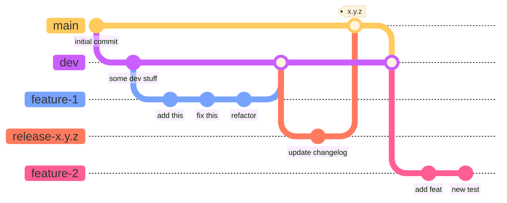

# How to Contribute to the `lymph` Package

First, thanks for considering to help out on this project!

Before you start coding away and fixing some of the [:link:issues], let me give you an introduction of the standards and best-practices that we have tried to follow so far:


## Git

We use [:link:git] as source control manager and [:link:GitHub] as the repository hosting service.


### Branching Model

Our branching model in [:link:git] looks like this:



So, we have a `main` branch where every tagged release lives. Then there's a `dev` branch that is the starting point for any feature branches or fixes. In these feature or fix branches, the actual work happens. When a feature or fix is ready, it gets merged into the `dev` branch, from where a new `release-x.y.z` branch is created to finalize and maybe also test a new release. When everything looks good, that `release-x.y.z` branch is merged into the `main` branch, tagged and a release is created from it.

This branching model is sometimes called [:link:git-flow] and it is worth reading through the original article for a clearer understanding of how and why this works.


### Semantic Versioning

For version numbers, we use [:link:SemVer]. Generally, under this standard, any version number follows the scheme

```
MAJOR.MINOR.PATCH
```

The idea is that any change (or suit of changes) in the software, causes one of the three numbers `MAJOR`, `MINOR`, or `PATCH` to increment by one.

If the changes just fix a bug, but leave the API of the code unchanged, `PATCH` is incremented by one.

When a new feature is introduced but backwards compatibility regarding the existing features is maintained, the `MINOR` version gets incremented by one.

And as soon as any so-called "breaking change" occurs that is incompatible with previous versions - for example, renaming a function or class would be a breaking change - the `MAJOR` version needs to be updated.

There is one exception: As ong as the `MAJOR` version is 0 (meaning this is still in its initial development), breaking changes may also "just" increment the `MINOR` version.


### Commit Messages

Since not so long ago, we use [:link:conventional commits] in this repository. This is a standard, defining how commit messages should be written. It is worth the time to read the quick introduction on their website. Using it makes it easier to auto-update a draft of the `CHANGELOG.md`.

To avoid accidentally committing anything with a non-standard commit message, you can install a commit: If you have installed the package with the `dev` dependencies (for example by typing `pip install -e .[dev]`), then you can install the commit hook(s) by typing:

```
pre-commit install
pre-commit install --hook-type commit-msg
```

make sure this happens inside the virtual environment you have set up.


## Documentation

Right now, we use [:link:sphinx] to compile a documentation from the docstrings of the code and host it on [:link:readthedocs].

However, I like the simplistic style of [:link:pdoc] a lot more that [:link:sphinx], which can be convoluted. So, I would like to switch to [:link:pdoc] at some point in the foreseeable future.

What I like about [:link:pdoc] is that for the documentation to turn out well and useful, the code is necessarily well documented. It should be easy to understand and well described even when only reading the source code.


### Docstrings

The code uses [:link:Google style docstrings] (or at least tries to do so most of the time). Generally, the [:link:Google Python style guide] is worth a read and handy for reference.

Here's an example:

```python
def my_well_named_function(
    first_parameter: bool,
    second_parameter: int,
    another_parameter: Dict[str, Any],
    optional_parameter: Optional[float] = None,
) -> np.ndarray:
    """This function is well named and does its job very well.

    After a blank line we can add a bit of a longer description. This can even span
    multiple lines if it is necessary. Afterwards, the arguments follow.

    Args:
        first_parameter: The first parameter is an integer.
        second_parameter: The second parameter is a string.
        another_parameter: The third parameter is a float.
        optional_parameter: The fourth parameter is optional.

    Returns:
        An array filled with some super useful values.

    Examples:
        >>> my_well_named_function(True, 42, {"a": 1, "b": 2}, 3.14)
        array([1, 2, 3])
    """
    # here comes the code
```


## Tests

For simple functions and methods, I really like writing short and illustrative examples that can be used by [:link:doctest] to test some basic functionality.

For more complicated stuff, we used [:link:pytest] and [:link:hypothesis] to cover a broad range of input values and edge cases. For the core components, this is important and ideally, with every new version of the package released, the portion of the code covered in tests goes up.


## Questions?

If there is still something unclear, feel free to reach out to me: [roman.ludwig@usz.ch](mailto:roman.ludwig@usz.ch).


[:link:issues]: https://github.com/rmnldwg/lymph/issues
[:link:git]: https://git-scm.com
[:link:GitHub]: https://github.com
[:link:git-flow]: https://nvie.com/posts/a-successful-git-branching-model/
[:link:SemVer]: https://semver.org/
[:link:conventional commits]: https://www.conventionalcommits.org/en/v1.0.0/#summary
[:link:sphinx]: https://www.sphinx-doc.org/en/master/
[:link:readthedocs]: https://readthedocs.org/
[:link:pdoc]: https://pdoc.dev
[:link:Google style docstrings]: https://google.github.io/styleguide/pyguide.html#38-comments-and-docstrings
[:link:Google Python style guide]: https://google.github.io/styleguide/pyguide.html
[:link:doctest]: https://docs.python.org/3.8/library/doctest.html
[:link:pytest]: https://docs.pytest.org/en/7.3.x/
[:link:hypothesis]: https://hypothesis.readthedocs.io/en/latest/
